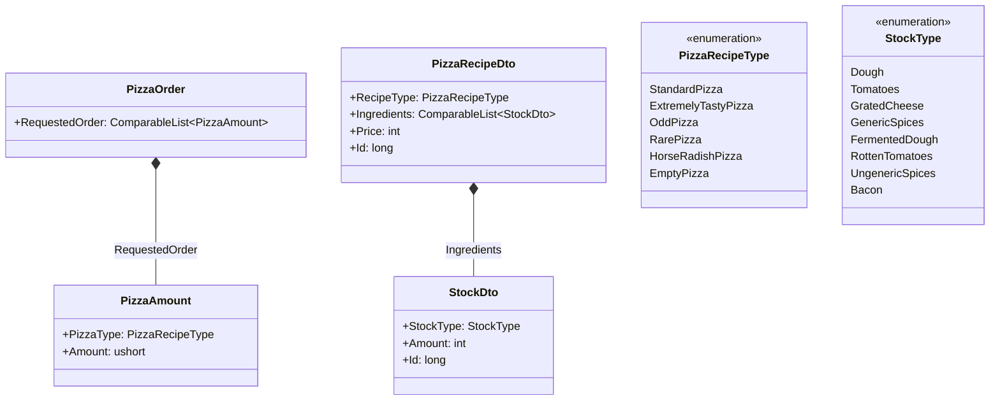

# PizzaPlace Types - UML

```mermaid
classDiagram
    PizzaOrder *-- PizzaAmount : RequestedOrder
    PizzaRecipeDto *-- StockDto : Ingredients
    
    class PizzaOrder {
        +RequestedOrder: ComparableList~PizzaAmount~
    }
    
    class PizzaAmount {
        +PizzaType: PizzaRecipeType
        +Amount: ushort
    }
    
    class PizzaRecipeDto {
        +RecipeType: PizzaRecipeType
        +Ingredients: ComparableList~StockDto~
        +Price: int
        +Id: long
    }
    
    class StockDto {
        +StockType: StockType
        +Amount: int
        +Id: long
    }
    
    class PizzaRecipeType {
        <<enumeration>>
        StandardPizza
        ExtremelyTastyPizza
        OddPizza
        RarePizza
        HorseRadishPizza
        EmptyPizza
    }
    
    class StockType {
        <<enumeration>>
        Dough
        Tomatoes
        GratedCheese
        GenericSpices
        FermentedDough
        RottenTomatoes
        UngenericSpices
        Bacon
    }
```
